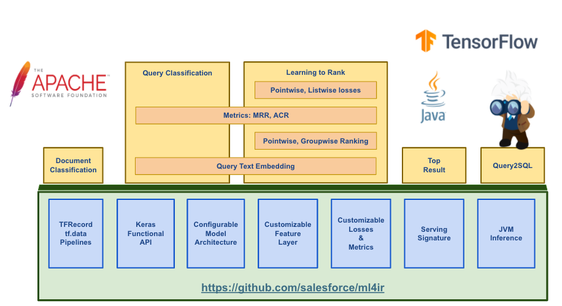

# ml4ir: Machine Learning for Information Retrieval
ml4ir is an open source library for training and deploying deep learning models for search applications. ml4ir is built on top of **python3** and **tensorflow 2.x** for training and evaluation. It also comes packaged with scala utilties for **JVM inference**.

ml4ir is designed as modular subcomponents which can each be combined and customized to build a variety of search ML models such as:
* Learning to Rank
* Query Auto Completion
* Document Classification
* Query Classification
* Named Entity Recognition
* Top Results
* Query2SQL
* *add your application here*
  

## Motivation
Search is a complex data space with lots of different types of ML tasks working on a combination of structured and unstructured data sources. There is no single library that
* provides an end-to-end training and serving solution for a variety of search applications
* allows training of models with limited coding expertise
* allows easy customization to build complex models to tackle the search domain
* focuses on performance and robustness
* enables fast prototyping

So, we built ml4ir to do all of the above. 

### Guiding Principles
**Customizable Library**

First and foremost, we want ml4ir to be an easy-to-use and highly customizable library so that you can build the search application of your need. ml4ir allows each of its subcomponents to be over-riden, mixed and match with other custom modules to create and deploy models.

**Configurable Toolkit**

While ml4ir can be used a library, it also comes pre-packaged with all the popular search based losses, metrics, embeddings, layers, etc. to enable someone with limited tensorflow expertise to quickly load their training data and train models for the task of interest. ml4ir achieves this by following a hybrid approach which allow for each subcomponent to be completely controlled through configurations alone. Most search based ML applications can be built this way. 

**Performance First**

ml4ir is built using the TFRecord data pipeline, which is the recommended data format for tensorflow data loading. We combine ml4ir's high configurability with out of the box tensorflow data optimization utilities to define model features and build a data pipeline that easily allows training on huge amounts of data. ml4ir also comes packaged with utilities to convert data from CSV and libsvm format to TFRecord.

**Training-Serving Handshake**

As ml4ir is a common library for training and serving deep learning models, this allows us to build tight integration and fault tolerance into the models that are trained. ml4ir also uses the same configuration files for both training and inference keeping the end-to-end handshake clean. This allows user's to easily plug in any feature store(or solr) into ml4ir's serving utilities to deploy models in one's production environments.

**Search Model Hub**

The goal of ml4ir is to form a common hub for the most popular deep learning layers, losses, metrics, embeddings used in the search domain. We've built ml4ir with a focus on quick prototyping with wide variety of network architectures and optimizations. We encourage contributors to add to ml4ir's arsenal of search deep learning utilities as we continue to do so ourselves.

## Getting Started
* [ml4ir ReadTheDocs](https://ml4ir.readthedocs.io/en/latest/)

## Continuous Integration 

We use CircleCI for running tests. Both jvm and python tests will run on each commit and pull request. You can find both the CI pipelines **[here](https://app.circleci.com/pipelines/github/salesforce/ml4ir)**
